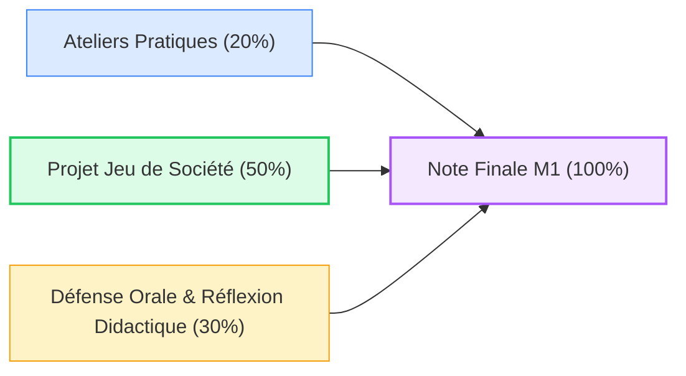

# 07. Guide & Évaluation

::: info Modalités pour étudiants en présentiel et à distance
Ce volet rassemble toutes les balises organisationnelles pour réussir votre Master 1, que vous puissiez assister aux séances sur place ou que vous suiviez le cours en autonomie complète à distance.
:::

### 🎯 Choisissez une sous-catégorie :

<SubCategoryTiles :items="subCategories" />

---

## Les 3 Piliers de l'Évaluation en Master 1

Consultez les sous-parties ci-dessus pour prendre connaissance des critères d'excellence et des consignes d'évaluation.
