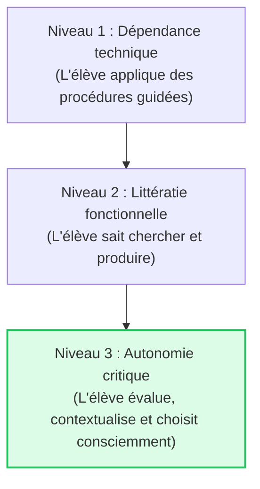

# 1.2. L'importance de l'Éducation aux Médias dans les Compétences Numériques

::: info Fondements et finalité émancipatrice
Nous vivons dans une société profondément médiatisée. L'éducation aux médias ne vise pas seulement à apprendre à « bien utiliser Internet », mais participe à une finalité démocratique et citoyenne essentielle : former des citoyens lucides, autonomes et capables de participer activement à la vie collective.
:::

---

## 1. Une dimension citoyenne essentielle

Pour pouvoir participer à la vie collective, un citoyen doit être capable de s'informer de manière autonome, de comprendre les débats publics et d'exprimer son point de vue. Dans une société où l'espace public est largement numérique, la maîtrise des médias devient une condition de la participation démocratique.

Le rôle de l'école n'est donc pas de sanctuariser un monde sans écran, mais d'outiller les élèves pour qu'ils ne soient pas de simples consommateurs passifs de flux algorithmiques.

---

## 2. L'esprit critique : le doute méthodique vs la méfiance systématique

L'esprit critique constitue une dimension essentielle des compétences numériques. Il ne consiste pas à rejeter systématiquement toute information, mais à :
- Interroger les sources et leurs intentions.
- Distinguer un fait avéré, une opinion subjective et une théorie spéculative.
- Identifier les biais de confirmation et les bulles de filtres.

::: tip Exemple du syllabus : Les théories du complot (« Le secret des dieux »)
Les théories du complot séduisent souvent parce qu'elles offrent des explications simplistes et rassurantes à des phénomènes complexes. En classe, l'approche didactique ne consiste pas à disqualifier brutalement la croyance de l'élève, mais à analyser la **rhétorique du complot** : l'absence de preuves présentée comme une preuve (« On vous cache tout »), l'infaillibilité du raisonnement circulaire et la désignation d'un coupable idéal.
:::

---

## 3. L'essor de l'IA générative et la vérification des sources

Avec l'arrivée des modèles de langage (LLM) et des générateurs d'images :
- Une fausse information peut être générée en quelques secondes avec un ton d'autorité parfait et une syntaxe irréprochable.
- Les hallucinations des modèles rendent indispensable la confrontation systématique avec des sources primaires vérifiables.
- L'élève doit apprendre à prompter avec rigueur, mais surtout à **évaluer la fiabilité de la réponse produite**.

---

## 4. La littératie numérique et la post-vérité

La littératie numérique dépasse la simple manipulation technique : elle consiste à comprendre la grammaire des médias numériques, leurs modèles économiques et leurs impacts psychosociaux.

::: warning Exemple du syllabus : La post-vérité et Donald Trump
Dans l'ère de la post-vérité, l'émotion et les croyances personnelles ont plus d'influence sur l'opinion publique que les faits objectifs vérifiés. La stratégie de communication de Donald Trump (répétition d'affirmations fausses, attaques directes contre les médias traditionnels qualifiés de « Fake News », appel au ressenti plutôt qu'à la preuve statistique) illustre parfaitement ce glissement où l'intensité émotionnelle prime sur l'exactitude factuelle.
:::

---

## 5. Produire pour mieux déconstruire

La meilleure façon pour un élève de comprendre la manipulation médiatique est d'en expérimenter lui-même la fabrication :
- En réalisant un court montage vidéo trompeur, l'élève comprend le pouvoir de la musique dramatisante et du cadrage.
- En rédigeant un faux article sensationnaliste, il identifie immédiatement les pièges du *clickbait*.

---

## 6. L'autonomie numérique face à la captologie

Être autonome ne signifie pas seulement savoir se débrouiller seul devant un écran. Cela implique de prendre conscience des stratégies de captation de l'attention mises en place par les plateformes :

::: tip Exemple du syllabus : La récompense aléatoire et la télé-réalité
Les algorithmes des réseaux sociaux et les programmes de télé-réalité exploitent le mécanisme psychologique du **conditionnement opérant à renforcement intermittent** (récompense aléatoire, comme dans une machine à sous). L'utilisateur actualise son flux sans savoir s'il va découvrir un contenu gratifiant, ce qui induit une dépendance comportementale. L'autonomie critique consiste à reprendre le contrôle sur son temps d'écran.
:::

---

## 7. Le sensationnalisme dans les médias

::: info Exemple du syllabus : « Fifi et Annie »
Le sensationnalisme repose sur la surexploitation d'anecdotes émotionnelles (faits divers poignants, récits sensationnalistes) au détriment de l'analyse structurelle des problèmes. Face à ce type de contenu, l'élève apprend à poser la question : *« Quel sentiment ce média cherche-t-il à provoquer en moi, et dans quel but ? »*.
:::

---

## Synthèse : De la dépendance vers l'autonomie critique

👉 **Atelier pratique associé** : [Atelier 2 : Évaluer une information et mener l'investigation](/ateliers/exercice-02)
