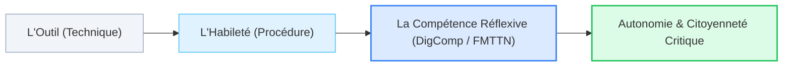

# 01. Compétences Numériques : de la Technique à l'Autonomie Critique

::: info Vue d'ensemble du module
Cette première grande thématique du cours pose les fondations didactiques indispensables : comment passer de la simple manipulation instrumentale d'un outil numérique à une véritable **compétence située, émancipatrice et critique**.
:::

### 🎯 Choisissez une sous-catégorie pour explorer le cours :

<SubCategoryTiles :items="subCategories" />

---

## Synthèse Fondamentale du Module

La notion de compétence numérique occupe aujourd’hui une place centrale dans les politiques éducatives. Elle est cependant souvent comprise de manière restrictive, comme la capacité à utiliser correctement un ordinateur, une tablette, un smartphone ou un logiciel. Cette conception réduit le numérique à sa dimension instrumentale.

Le cadre européen **DigComp** et le référentiel de la **Fédération Wallonie-Bruxelles** dépassent cette conception : être compétent ne consiste pas seulement à savoir utiliser une technologie, mais à savoir mobiliser cette technologie de manière pertinente dans une situation complexe, tout en appréciant ses possibilités, ses biais et ses limites éthiques.

Consultez les 4 sous-parties détaillées ci-dessus pour approfondir chaque axe du syllabus officiel et préparer les ateliers pratiques associés.
