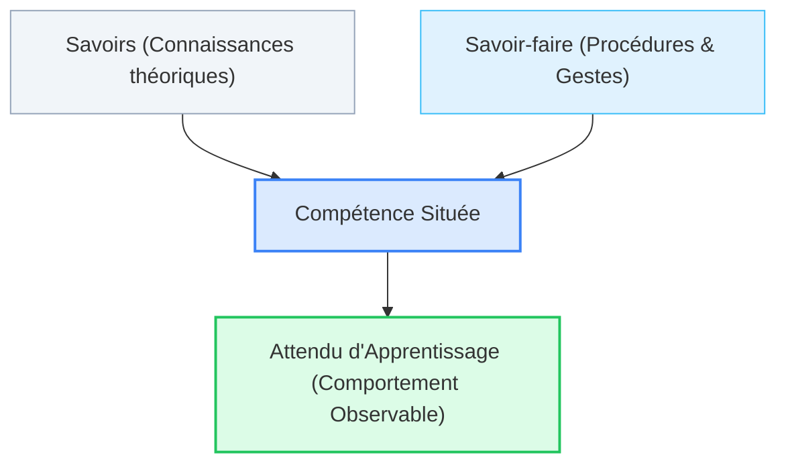

# 2.4. Savoirs, Savoir-Faire & Attendus d'Apprentissage

::: info Rigueur terminologique
Pour concevoir une leçon ou une évaluation conforme aux exigences académiques de la HECh, il est impératif d'utiliser le vocabulaire exact du référentiel ministériel FWB.
:::

## 1. La hiérarchie des concepts

  

### Définitions opérationnelles :
- **Le Savoir** : Connaissances conceptuelles déclaratives. *Exemple : Connaître le rôle d'un processeur, d'une mémoire vive ou d'une adresse IP.*
- **Le Savoir-Faire** : Capacité à exécuter une procédure technique ou un geste professionnel. *Exemple : Savoir brancher un câble HDMI ou appliquer un filtre de tri dans un tableur.*
- **La Compétence** : Faculté de mobiliser conjointement savoirs et savoir-faire pour résoudre une tâche inédite dans un contexte complexe.
- **L'Attendu** : Formulation précise de ce que l'élève doit manifester au terme de la séquence. L'attendu est **évaluable et observable**.

---

## 2. Règle d'or de l'enseignant FMTTN

> **On n'invente jamais un attendu d'apprentissage.**  
> L'enseignant puise fidèlement dans le texte légal du référentiel (`refFMTTN.pdf`), puis scénarise une situation didactique permettant d'entraîner et de certifier cet attendu spécifique.

👉 **Mise en pratique** : [Atelier 4 : Escape Game FMTTN](/ateliers/exercice-04)
