# 3.1. Situation-Problème & Apprentissage par Problème

::: info Inversion de la posture magistrale
Enseigner le numérique ne consiste pas à dérouler les fonctionnalités d'un logiciel dans un exposé magistral. La **situation-problème** part d'une énigme, d'un dysfonctionnement ou d'un besoin authentique pour donner immédiatement du sens aux apprentissages.
:::

## 1. La bascule didactique : Transmissif vs Problématisé

```mermaid
graph TD
    subgraph "Approche Transmissive Traditionnelle (À Éviter)"
        A1["1. Présentation magistrale de l'outil"] --> A2["2. Démonstration des fonctionnalités par le prof"]
        A2 --> A3["3. Exercice d'application répétitif"]
    end
    
    subgraph "Démarche par Situation-Problème (FMTTN)"
        B1["1. Confrontation à un problème réel / défi"] --> B2["2. Recherche, hypothèses & expérimentation élève"]
        B2 --> B3["3. Découverte du besoin de l'outil numérique"]
        B3 --> B4["4. Institutionnalisation & Synthèse des savoirs"]
    end
    
    style A1 fill:#fee2e2,stroke:#ef4444
    style A2 fill:#fee2e2,stroke:#ef4444
    style A3 fill:#fee2e2,stroke:#ef4444
    style B1 fill:#dcfce7,stroke:#22c55e
    style B2 fill:#dbeafe,stroke:#3b82f6
    style B3 fill:#e0e7ff,stroke:#6366f1
    style B4 fill:#fef3c7,stroke:#f59e0b
```

  

---

## 2. Caractéristiques d'une bonne situation-problème en FMTTN

1. **Accessible mais résistante** : L'élève doit pouvoir démarrer avec ses connaissances préalables, mais rencontrer un obstacle cognitif qu'il ne peut surmonter sans un nouvel apprentissage.
2. **Contextualisée dans le réel** : Une situation proche du quotidien des jeunes (ex : un mot de passe piraté, une vidéo trop lourde pour être envoyée, un ordinateur qui ne démarre plus).
3. **Pluralité des démarches** : Plusieurs chemins de résolution sont possibles, favorisant le débat socio-constructiviste en classe.
