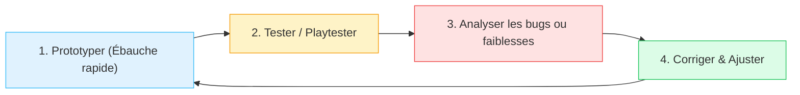

# 3.5. Démarche Itérative & Droit à l'Erreur

::: info L'erreur comme moteur d'apprentissage
En informatique et en technologie, personne ne produit un code parfait ou un objet fonctionnel du premier coup. Le cœur de la démarche d'ingénierie réside dans l'**itération** : concevoir, tester, échouer, comprendre l'erreur, corriger et recommencer.
:::

## 1. La boucle de conception itérative

  

---

## 2. Réhabiliter le statut de l'erreur à l'école

Dans le modèle scolaire traditionnel, l'erreur est souvent sanctionnée par une mauvaise note (faute).  
En didactique du numérique, **l'erreur est une donnée d'apprentissage normale et féconde** :
- Un message d'erreur d'un compilateur n'est pas un blâme, c'est une indication précieuse pour progresser.
- Une découpeuse laser qui brûle trop le bois révèle qu'il faut calibrer la vitesse et la puissance.
- Un jeu dont les règles bloquent les joueurs lors d'un test démontre qu'il faut reformuler l'énoncé.

👉 **Mise en pratique au FabLab** : [Prototypage FabLab & Découpe Laser](/modules/09-prototypage-fablab)
