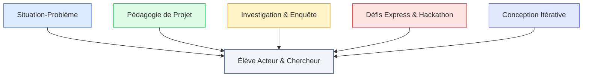

# 03. Méthodologies Pédagogiques : Enseigner par l'Action

::: info Rupture didactique
Dans le volet numérique du FMTTN, l'enseignant n'est plus un simple transmetteur de modes d'emploi informatiques. Il devient **concepteur de situations d'apprentissage**, médiateur et facilitateur de l'autonomie des élèves.
:::

### 🎯 Choisissez une sous-catégorie pour explorer les démarches :

<SubCategoryTiles :items="subCategories" />

---

## Les 5 Méthodologies Clés en un Coup d'Œil

Consultez les sous-parties ci-dessus pour découvrir les analyses théoriques, exemples de classe et conseils de mise en œuvre.
