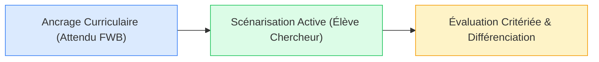

# 04. Préparer une Leçon FMTTN

::: info Ingénierie didactique
Préparer une leçon en FMTTN exige une posture rigoureuse : on ne choisit jamais une technologie parce qu'elle est séduisante ou ludique, mais parce qu'elle sert exclusivement un **apprentissage ciblé et explicite**.
:::

### 🎯 Choisissez une sous-catégorie pour explorer l'ingénierie :

<SubCategoryTiles :items="subCategories" />

---

## Le Triptyque de la Préparation Réussie

Consultez les sous-parties ci-dessus pour accéder aux modèles de fiches, banques de verbes et invites IA prêtes à l'emploi.
