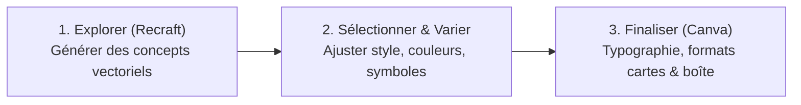

# 6.4. Créer des cartes et supports de jeu avec l'IA

::: info Extrait intégral des Notes de cours
Ce chapitre reproduit fidèlement et dans son intégralité les contenus didactiques et techniques du syllabus officiel du cours de Didactique du numérique (Master 1 - HECh) concernant la conception de supports avec l'intelligence artificielle générative.
:::

## Créer des supports pédagogiques avec l’aide de l’intelligence artificielle

L’intelligence artificielle générative peut faciliter la conception de supports pédagogiques, à condition de l’utiliser comme un **outil d’assistance à la conception** et non comme un substitut au travail de l’enseignant. L’enjeu consiste à **conserver la maîtrise des objectifs d’apprentissage, des contenus, de la progression et des choix didactiques**, tout en utilisant l’IA pour accélérer certaines tâches de production.

---

## 8.1. Concevoir un syllabus et structurer les règles avec ChatGPT

Pour construire un syllabus, un ensemble de supports de cours ou formaliser les règles d'un jeu de société, la fonction **Projet** de ChatGPT peut être particulièrement utile. Elle permet de regrouper au même endroit les documents sources, les consignes didactiques et l'ensemble des échanges liés à un même projet.

### La démarche méthodologique : « Saucissonner la matière »

Une bonne pratique consiste à **saucissonner la matière**, c’est-à-dire à la diviser en unités de travail clairement identifiées plutôt que de demander à l’IA de produire l’intégralité du cours ou du jeu en une seule fois.

Le découpage permet notamment de **conserver davantage de contrôle sur le contenu** et d’éviter qu’une production trop volumineuse ne devienne difficile à vérifier, incohérente ou sujette aux hallucinations.

#### Procédure conseillée en 6 étapes :

1. **Définir les objectifs généraux** du cours ou du jeu de société (attendus pédagogiques, compétences ciblées, profil des joueurs).
2. **Découper la matière** en chapitres, séquences ou catégories de cartes bien délimitées.
3. **Préciser pour chaque séquence** les objectifs d’apprentissage, les notions clés à traiter et les activités ou mécaniques envisagées.
4. **Faire produire chaque partie séparément par l’IA**, en guidant précisément le niveau de détail attendu.
5. **Vérifier scrupuleusement les informations**, les références théoriques et la cohérence pédagogique.
6. **Harmoniser ensuite l'ensemble du support** : vocabulaire employé, structure narrative, niveau de difficulté, progression et charte de mise en forme.

---

## 8.2. Créer des images et exploiter le multimodal avec Google Gemini

Pour la création d’images et les productions multimodales, **Google Gemini** peut être utilisé pour expérimenter différentes représentations visuelles : illustrations de cartes, personnages récurrents, décors, scènes d'action, énigmes visuelles ou éléments graphiques du plateau.

L’approche multimodale permet également de **partir d'une image existante** (un croquis fait main, une photographie prise lors de l'atelier photo, un plan de jeu), d'en analyser les caractéristiques et de demander des transformations, des variations stylistiques ou de nouvelles propositions.

### Les 8 paramètres indispensables d'un prompt visuel contrôlable

Pour obtenir une production visuelle pertinente et exploitable, il est recommandé de décrire précisément les 8 dimensions suivantes :

| Paramètre | Fonction didactique | Exemple concret pour une carte de jeu |
| :--- | :--- | :--- |
| **1. Le sujet ou personnage** | Identifie l'élément central | *« Une jeune enquêtrice en cybersécurité »* |
| **2. L’action réalisée** | Donne vie et intention à l'image | *« observant un cadenas numérique ouvert avec une loupe »* |
| **3. Le décor** | Situe l'action dans un contexte | *« dans une salle de serveurs informatiques tamisée »* |
| **4. Le cadrage** | Définit l'échelle de plan (cf. module photo) | *« plan rapproché taille, vue de trois-quarts »* |
| **5. Le style graphique** | Assure l'homogénéité du jeu | *« illustration vectorielle épurée, flat design moderne, aplats nets »* |
| **6. L’ambiance & éclairage** | Crée le climat émotionnel | *« éclairage néon bleu et violet, reflets doux sur les écrans »* |
| **7. Le format souhaité** | Règle le ratio pour l'impression | *« format vertical ratio 2:3 adapté à une carte de jeu »* |
| **8. Éléments à conserver / modifier** | Guide l'itération multimodale | *« conserver la coiffure et le style vectoriel, remplacer la loupe par une clé USB »* |

---

## 8.3. Affiner les productions avec Canva

Une image brute générée par IA constitue **rarement un produit final directement exploitable** pour un jeu de société ou un support d'enseignement. Canva est utilisé dans une seconde étape pour peaufiner la production et assurer son ergonomie :

- **Recadrage et redimensionnement** aux formats standards de cartes de jeu (ex. format bridge ou poker) ;
- **Suppression ou ajout d’éléments** graphiques parasites ;
- **Détourage automatique** du sujet pour l'isoler sur un fond thématique ;
- **Intégration de texte**, de bandeaux d'intitulé, de coûts en points ou de pictogrammes de règles ;
- **Composition de plusieurs éléments** (assemblage du personnage, du fond et des icônes) ;
- **Harmonisation graphique** pour garantir que toutes les cartes partagent la même identité visuelle ;
- **Création d’une version adaptée à l’impression** (gestion des marges, repères de découpe) ou au numérique.

> [!TIP] Règle d'or de la chaîne de fabrication
> **L’IA produit la matière première visuelle brute**, tandis que **l’outil de conception graphique permet de réaliser les choix graphiques et ergonomiques finaux**.

---

## 8.4. S’inspirer de prompts avec Leonardo.Ai

**Leonardo.Ai** peut être mobilisé comme une excellente source d’inspiration pour l'apprentissage de l'ingénierie de prompt (*prompt design*).

L’objectif n’est pas nécessairement de produire l’image finale avec cet outil. Les utilisateurs peuvent :
1. **Observer la communauté** et analyser les descriptions textuelles employées pour obtenir des résultats graphiques spécifiques ;
2. **Identifier les mots-clés et descripteurs efficaces** au sein d’un prompt (vocabulaire de texture, éclairage, optique, style artistique) ;
3. **Personnaliser et transposer ces structures de prompts** pour leur propre projet de jeu.

Cette démarche réflexive permet de développer progressivement une compétence essentielle de la translittératie numérique : **passer d’une demande générale et floue à une consigne de génération précise, structurée et contrôlable**.

---

## 8.5. Créer un avatar cohérent dans différentes situations

Pour un jeu pédagogique, la présence d’un **personnage récurrent** (mascotte, guide, antagoniste, figure d'enquête) contribue grandement à donner une identité narrative et visuelle forte aux cartes, aux consignes et aux différentes étapes du jeu.

Un avatar peut être créé avec Gemini, éventuellement à partir d’un agent personnalisé tel qu’un **Gem** (Google) ou un agent spécialisé avec **Mistral AI**, pour formaliser les caractéristiques du personnage et mémoriser ces données tout au long de la chaîne de travail.

### La Fiche d'Identité Visuelle du personnage

L’objectif est d'établir en amont une fiche descriptive rigoureuse qui servira d'ancrage permanent à l'IA :

- 👤 **Apparence physique** : silhouette, tranche d'âge, forme du visage, couleur des yeux, coupe de cheveux ;
- 👕 **Vêtements** : tenue emblématique, style vestimentaire reconnaissable au premier coup d'œil ;
- 🎨 **Palette de couleurs** : 2 à 3 teintes dominantes immuables ;
- 🎒 **Accessoires** : objet distinctif porté par le personnage (lunettes, sacoche, tablette, badge) ;
- 🖌️ **Style graphique** : 2D aplat, bande dessinée franco-belge, rendu 3D stylisé ;
- 🔍 **Caractéristiques distinctives** : signe particulier facilitant l'identification immédiate.

Une fois cette référence stabilisée, elle est réutilisée pour générer le même personnage dans des postures variées : *debout, assis, en train de courir, de réfléchir, de manipuler un composant technique, d'indiquer une direction, d'exprimer le succès ou le blocage*.

> [!WARNING] Point d’attention critique
> La cohérence parfaite d’un personnage entre plusieurs générations d'IA n’est jamais garantie à 100 %. Il est donc indispensable d'exercer un regard critique, de comparer attentivement les visuels générés et de conserver précieusement les images de référence étalons.

---

## 8.6. Créer le logo du jeu avec Recraft puis Canva

Pour concevoir le logo et l'identité de marque du jeu de société, **Recraft** offre des capacités avancées de génération graphique vectorielle et d'icônes stylisées.

La démarche s'articule en **trois temps successifs** :

1. **Explorer (Recraft)** : Définir le ton et générer plusieurs propositions visuelles correspondant au thème et au public du jeu (icônes vectorielles, badges, emblèmes).
2. **Sélectionner et améliorer** : Choisir la direction graphique la plus percutante et demander des variantes ciblées (ajustement du symbole, de la palette de couleurs, simplification des traits).
3. **Finaliser dans Canva** : Importer l'élément retenu dans Canva pour ajouter la typographie du titre, équilibrer les espacements et décliner le logo dans les formats utiles : plateau de jeu, dos des cartes, couverture du livret de règles et supports de présentation.

---

## 📝 Exercice Pratique Associé : Exercice 11 (Supports du jeu avec l'IA)

  
📋 EXERCICE 11 — CRÉER LES SUPPORTS DE VOTRE JEU AVEC L’IA

  
  

    <strong>Objectif de l'atelier :</strong> À partir du concept et des règles de votre jeu de société, vous allez produire en binôme les principaux supports nécessaires à sa présentation et à son utilisation en classe. Vous utiliserez de manière articulée plusieurs outils d’IA et de conception graphique. L’objectif n’est pas seulement de générer du contenu brut, mais de <strong>concevoir, sélectionner, vérifier, critiquer et améliorer</strong> les productions obtenues.
  

  

    <h4 style="margin-top: 0; color: var(--vp-c-brand-1); display: flex; align-items: center; gap: 8px;">
      🎨 Volet 1 : Créer le logo du jeu — Recraft + Canva
    </h4>
    

      Concevez une identité visuelle originale. Définissez ce que doit transmettre le logo (nom, thème, public cible, ambiance). Générez des pistes sur <strong>Recraft</strong>, sélectionnez la meilleure proposition, importez-la dans <strong>Canva</strong> pour caler la typographie et la lisibilité. 
      <strong>Livrable attendu :</strong> 1 logo final haute résolution + variantes (fond transparent, monochrome).
    

    <h4 style="margin-top: 1rem; color: var(--vp-c-brand-1); display: flex; align-items: center; gap: 8px;">
      📖 Volet 2 : Créer le manuel de règles — ChatGPT + Canva
    </h4>
    

      Rédigez le manuel permettant à un joueur autonome de comprendre et jouer sans aide extérieure. Utilisez <strong>ChatGPT</strong> pour structurer les rubriques (objectif, matériel, mise en place, déroulement du tour, conditions de victoire, exemples). Corrigez impérativement les erreurs et hallucinations, puis mettez en page sous forme de livret/brochure dans <strong>Canva</strong>. 
      <strong>Livrable attendu :</strong> 1 livret de règles complet et prêt à être distribué aux joueurs.
    

    <h4 style="margin-top: 1rem; color: var(--vp-c-brand-1); display: flex; align-items: center; gap: 8px;">
      🃏 Volet 3 : Créer les cartes du jeu — Gemini + Canva
    </h4>
    

      Produisez le deck complet de cartes nécessaires au jeu (Questions, Défis, Événements, Objets, Rôles). Utilisez <strong>Gemini</strong> pour formuler les textes et générer les visuels selon la grille des 8 paramètres. Créez un gabarit de carte homogène dans <strong>Canva</strong> et déclinez l'ensemble du jeu en veillant aux contrastes et à la jouabilité. 
      <strong>Livrable attendu :</strong> 1 jeu complet de cartes prêt à être imprimé et découpé.
    

  

  

    <a 
      href="/documents/Exercice-11-Supports-IA.docx" 
      download
      class="btn-primary"
      style="display: inline-flex; align-items: center; gap: 8px; text-decoration: none !important; color: white !important; padding: 10px 18px; border-radius: 8px; font-weight: 600; background: var(--vp-c-brand-1);"
    >
      📥 Télécharger la fiche de l'Exercice 11 (.docx)
    </a>
  

  

    📤 <strong>Dépôt du travail :</strong> Une fois vos maquettes finalisées, déposez vos fichiers (logo, livret de règles PDF et planches de cartes) directement dans votre <a href="/espace-membre"><strong>Espace Membre</strong></a> (onglet <em>« Dépôt de Travaux »</em>).
  

---

## 🎓 Auto-évaluation & Réflexivité (6.4)

Testez votre compréhension de la conception de supports avec l'IA et portez un regard réflexif sur l'Exercice 11 :

<ClientOnly>
  <QuizBox moduleId="08" moduleTitle="6.4 Créer des cartes et supports de jeu avec l'IA" />
</ClientOnly>

---

## Navigation
- ⬅️ **[6.3 La photographie & composition](/modules/07-photographie-image)**
- 🏠 **[06. Hub Projet Jeu de société](/modules/05-projet-jeu-societe)**
- ➡️ **[6.5 Prototypage FabLab (Laser & 3D)](/modules/09-prototypage-fablab)**
